# MyBatis学习

- 官方文档：[mybatis – MyBatis 3 | 简介](https://mybatis.org/mybatis-3/zh/index.html)
- Github：[mybatis/mybatis-3: MyBatis SQL mapper framework for Java (github.com)](https://github.com/mybatis/mybatis-3)
- 参考视频：[【狂神说Java】Mybatis最新完整教程IDEA版通俗易懂_哔哩哔哩_bilibili](https://www.bilibili.com/video/BV1NE411Q7Nx)
- 项目完整代码参考：[lexiaoyuan/MyBatisStudy: My MyBatis study notes (github.com)](https://github.com/lexiaoyuan/MyBatisStudy)、[MyBatisStudy: 我的MyBatis学习笔记 (gitee.com)](https://gitee.com/lexiaoyuan/mybatis-study)

## 简介

官网文档：[https://mybatis.org/mybatis-3/zh/index.html](https://mybatis.org/mybatis-3/zh/index.html)

- maven仓库：

```xml
<!-- https://mvnrepository.com/artifact/org.mybatis/mybatis -->
<dependency>
    <groupId>org.mybatis</groupId>
    <artifactId>mybatis</artifactId>
    <version>3.5.2</version>
</dependency>
```

- GitHub：[https://github.com/mybatis/mybatis-3/releases](https://github.com/mybatis/mybatis-3/releases)

> 环境：
>
> - jdk 1.8
> - mysql 5.7
> - maven 3.6.1
> - idea

### 思路

> 搭建环境——》导入MyBatis——》编写代码——》测试

## 第一个MyBatis程序

### 搭建环境

1. 创建数据库

```sql
create database mybatis;
show databases;
use mybatis;
create table user(id int(20) primary key, name varchar(30) default null, pwd varchar(30) default null)engine=innodb default charset=utf8mb4;
insert into user(id, name, pwd) values (1, '乐小猿', 'admin'),(2, '张三', '123456'),(3, '李四', '789456');
select * from user;
```

2. 新建项目

- 新建普通maven工程

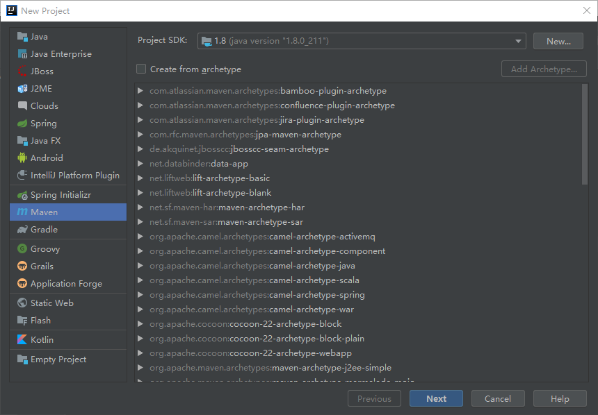

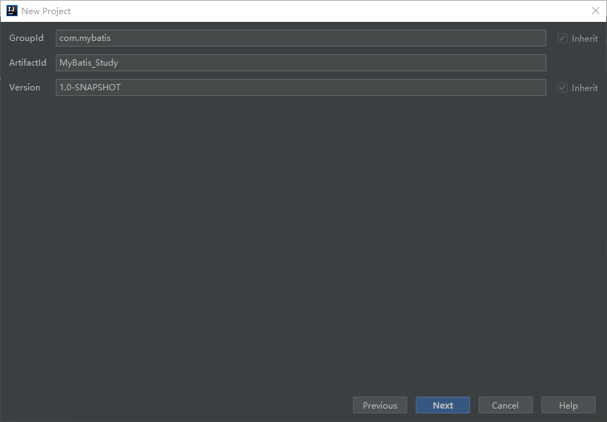

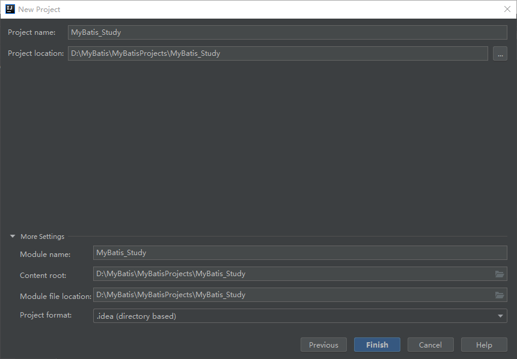

- 删除src目录

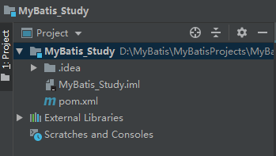

### 导入maven依赖(pom.xml)

```xml
<!-- 导入依赖 -->
<dependencies>
    <!-- MySQL 驱动-->
    <dependency>
        <groupId>mysql</groupId>
        <artifactId>mysql-connector-java</artifactId>
        <version>5.1.47</version>
    </dependency>
    <!-- MyBatis-->
    <dependency>
        <groupId>org.mybatis</groupId>
        <artifactId>mybatis</artifactId>
        <version>3.5.2</version>
    </dependency>
    <!-- junit-->
    <dependency>
        <groupId>junit</groupId>
        <artifactId>junit</artifactId>
        <version>4.12</version>
    </dependency>
</dependencies>
```

### 创建模块

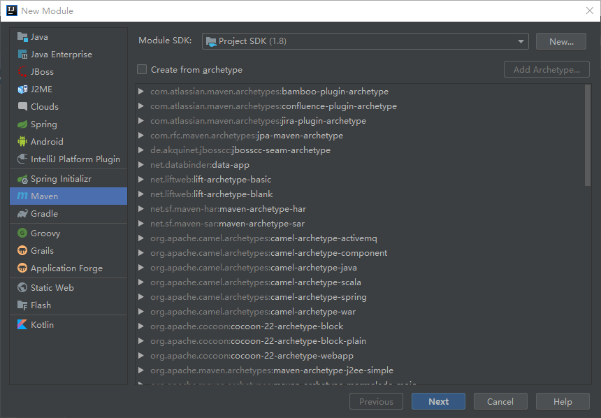

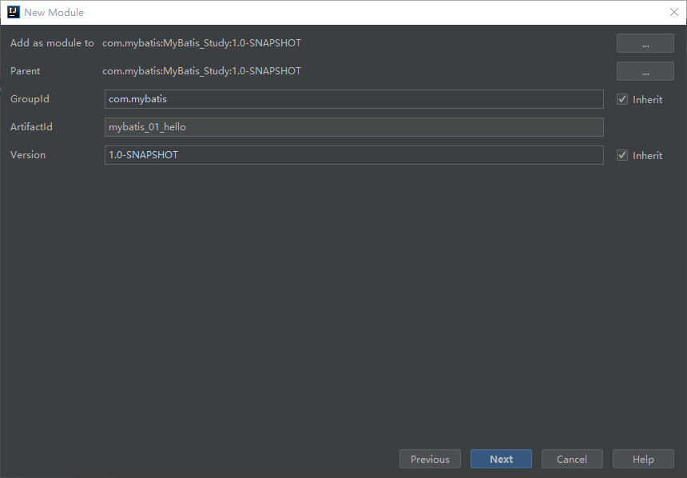

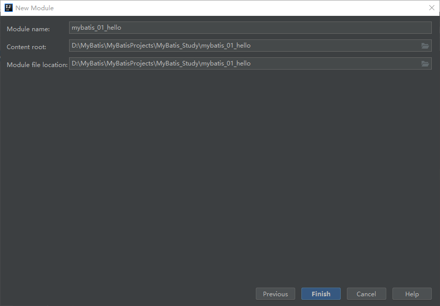

### 创建核心配置文件

 **resources\mybatis-config.xml**

```xml
<?xml version="1.0" encoding="UTF-8" ?>
<!DOCTYPE configuration
        PUBLIC "-//mybatis.org//DTD Config 3.0//EN"
        "http://mybatis.org/dtd/mybatis-3-config.dtd">
<!--核心配置文件-->
<configuration>
    <environments default="development">
        <environment id="development">
            <!-- 事务管理-->
            <transactionManager type="JDBC"/>
            <dataSource type="POOLED">
                <property name="driver" value="com.mysql.jdbc.Driver"/>
                <property name="url" value="jdbc:mysql://localhost:3306/mybatis?useUnicode=true&amp;characterEncoding=UTF-8&amp;serverTimezone=UTC&amp;useSSL=true"/>
                <property name="username" value="root"/>
                <property name="password" value="123456"/>
            </dataSource>
        </environment>
    </environments>

</configuration>
```

### 编写MyBatis工具类

```java
//得到sqlSession
public class MyBatisUtil {

    private static SqlSessionFactory sqlSessionFactory = null;

    static {
        try {
            //使用MyBatis第一步：获取SqlSessionFactory对象
            String resource = "mybatis-config.xml";
            InputStream inputStream = Resources.getResourceAsStream(resource);
            sqlSessionFactory = new SqlSessionFactoryBuilder().build(inputStream);
        } catch (IOException e) {
            e.printStackTrace();
        }
    }

    //第二步：从 SqlSessionFactory 中获取 SqlSession
    public static SqlSession getSqlSession() {
        return sqlSessionFactory.openSession();
    }
}
```

### 编写实体类

> 与表对应的实体类

```java
//实体类
public class User {
    private int id;
    private String name;
    private String pwd;

    //构造、get、set、toString方法
    // ...
}
```

### 编写接口

> 与实体类对应的接口

```java
public interface UserMapper {
    //查
    List<User> getUserList();
    //增、删、改
    // ...
}
```

### 编写SQL语句

> 通过xml定义，并使其满足SqlSession的调用。xml文件代替了接口实现类的作用，通过namespace来绑定接口

```xml
<?xml version="1.0" encoding="UTF-8" ?>
<!DOCTYPE mapper
        PUBLIC "-//mybatis.org//DTD Mapper 3.0//EN"
        "http://mybatis.org/dtd/mybatis-3-mapper.dtd">

<!--namespace=绑定一个对应的Dao/Mapper接口-->
<mapper namespace="com.mybatis.dao.UserMapper">
    <!-- id=UserMapper接口中的方法名 resultType=sql语句返回的结果类型，写全限定名-->
    <select id="getUserList" resultType="com.mybatis.pojo.User">
        select * from mybatis.user
    </select>
</mapper>
```

### 在核心配置文件中注册Mapper

```xml
<!--每一个Mapper.xml都需要在MyBatis核心配置文件中注册-->
<mappers>
    <mapper resource="com/mybatis/dao/UserMapper.xml"/>
</mappers>
```

### 测试

```java
public class UserDaoTest {

    @Test
    public void Test() {

        //第一步：获取SqlSession对象
        SqlSession sqlSession = MyBatisUtil.getSqlSession();

       try {
            //第二步：执行SQL，通过getMapper(接口对象)得到接口对象
            UserMapper mapper = sqlSession.getMapper(UserMapper.class);
            //调用接口对象的方法
            List<User> userList = mapper.getUserList();

            for (User user : userList) {
                System.out.println(user);
            }
        } catch (Exception e) {
            e.printStackTrace();
        } finally {
            //第三步：关闭SqlSession
            sqlSession.close();
        }

    }
}
```

运行结果：

```
User{id=1, name='乐小猿', pwd='admin'}
User{id=2, name='张三', pwd='123456'}
User{id=3, name='李四', pwd='789456'}
```

## 遇到的问题及解决

1. 找不到UserMapper.xml

```
java.lang.ExceptionInInitializerError
Caused by: org.apache.ibatis.exceptions.PersistenceException: 
### Error building SqlSession.
### The error may exist in com/mybatis/dao/UserMapper.xml
Caused by: java.io.IOException: Could not find resource com/mybatis/dao/UserMapper.xml
```

> 原因：Maven项目中，.xml文件默认需要写在resources目录下，这里的UserMapper.xml写在com/mybatis/dao/UserMapper.xml目录下，**maven无法正常导出**。
>
> 解决：手动配置Maven资源过滤，在当前模块的pom.xml中添加：

```xml
<!--手动配置Maven的资源过滤-->
<build>
    <resources>
        <resource>
            <directory>src/main/resources</directory>
            <includes>
                <include>**/*.properties</include>
                <include>**/*.xml</include>
            </includes>
            <filtering>true</filtering>
        </resource>
        <resource>
            <directory>src/main/java</directory>
            <includes>
                <include>**/*.properties</include>
                <include>**/*.xml</include>
            </includes>
            <filtering>true</filtering>
        </resource>
    </resources>
</build>
```

2. 项目编码不统一

```
org.springframework.beans.factory.BeanDefinitionStoreException: 
com.sun.org.apache.xerces.internal.impl.io.MalformedByteSequenceException: 3 字节的 UTF-8 序列的字节 3 无效。
```

> 解决：在当前模块的pom.xml中添加如下代码：
>
> ```xml
> <properties>
>        <project.build.sourceEncoding>UTF-8</project.build.sourceEncoding>
> </properties>
> ```

## 补充：IDEA连接MySQL

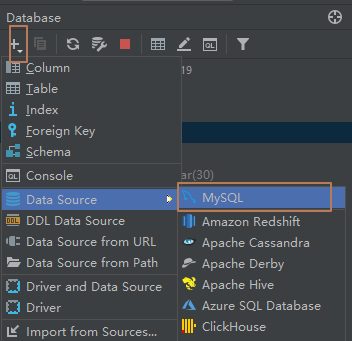

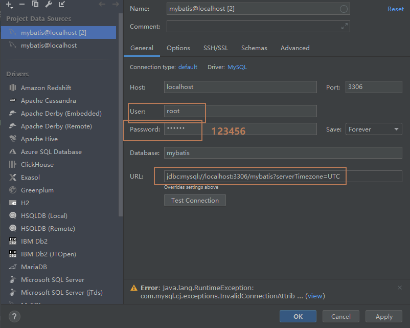

> URL:`jdbc:mysql://localhost:3306/mybatis?serverTimezone=UTC`
>
> 注意：需要设置时区：`serverTimezone=UTC`

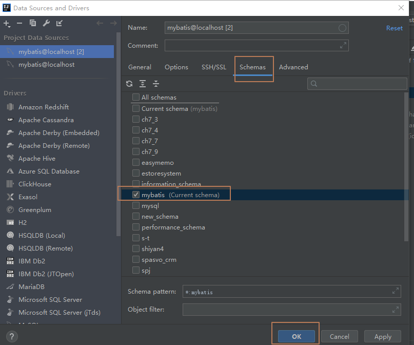

## 增删改查

> 先写接口--》再写sql语句--》再写测试

1. 扩充接口

```java
//根据id查询用户
User getUserById(int id);

//增-插入一个用户
int addUser(User user);

// 删-删除一个用户
int deleteUser(int id);

// 改
int updateUser(User user);
```

2. 写sql

```xml
<select id="getUserById" parameterType="int" resultType="com.mybatis.pojo.User">
    select * from mybatis.user where id=#{id};
</select>

<insert id="addUser" parameterType="com.mybatis.pojo.User">
    insert into mybatis.user(id, name, pwd) value (#{id}, #{name}, #{pwd});
</insert>

<delete id="deleteUser" parameterType="com.mybatis.pojo.User">
    delete from mybatis.user where id=#{id};
</delete>

<update id="updateUser" parameterType="com.mybatis.pojo.User">
    update mybatis.user set name=#{name}, pwd=#{pwd}  where id=#{id};
</update>
```

3. 写测试

```java
@Test
public void getUserByIdTest(){
    SqlSession sqlSession = MyBatisUtil.getSqlSession();
    UserMapper mapper = sqlSession.getMapper(UserMapper.class);

    User userById = mapper.getUserById(1);
    System.out.println(userById);

    sqlSession.close();
}

@Test
public void addUserTest(){
    SqlSession sqlSession = MyBatisUtil.getSqlSession();
    UserMapper mapper = sqlSession.getMapper(UserMapper.class);

    mapper.addUser(new User(4, "徐仕成", "111222"));

    //增删改一定要提交事务
    sqlSession.commit();
    sqlSession.close();
}

@Test
public void deleteUserTest(){
    SqlSession sqlSession = MyBatisUtil.getSqlSession();
    UserMapper mapper = sqlSession.getMapper(UserMapper.class);

    mapper.deleteUser(2);

    sqlSession.commit();
    sqlSession.close();

}

@Test
public void updateUserTest(){
    SqlSession sqlSession = MyBatisUtil.getSqlSession();
    UserMapper mapper = sqlSession.getMapper(UserMapper.class);

    mapper.updateUser(new User(4, "呵呵呵", "word"));

    sqlSession.commit();
    sqlSession.close();

}
```

> 注意：**增删改一定要提交事务**

## 配置解析

### 1. 环境配置（environments）

```xml
<environments default="development">
  <environment id="development">
    <transactionManager type="JDBC">
      <property name="..." value="..."/>
    </transactionManager>
    <dataSource type="POOLED">
      <property name="driver" value="${driver}"/>
      <property name="url" value="${url}"/>
      <property name="username" value="${username}"/>
      <property name="password" value="${password}"/>
    </dataSource>
  </environment>
</environments>
```

> - **MyBatis 可以配置成适应多种环境,，但每个 SqlSessionFactory 实例只能选择一种环境。**
> - **MyBatis默认事务管理器（transactionManager）为JDBC**
> - **MyBatis默认数据源（dataSource）为POOLED**

### 2. 属性（properties）

编写配置文件db.properties

```properties
driver=com.mysql.jdbc.Driver
url=jdbc:mysql://localhost:3306/mybatis?useUnicode=true&characterEncoding=UTF-8&serverTimezone=UTC&useSSL=true
username=root
password=123456
```

修改核心配置文件

```xml
<properties resource="db.properties"/>

<environments default="development">
    <environment id="development">
        <transactionManager type="JDBC"/>
        <dataSource type="POOLED">
            <property name="driver" value="${driver}"/>
            <property name="url" value="${url}"/>
            <property name="username" value="${username}"/>
            <property name="password" value="${password}"/>
        </dataSource>
    </environment>
</environments>
```

### 3. 类型别名（typeAliases）

```xml
<!--使用别名-->
<typeAliases>
    <!-- 方式一：实体类较少时使用-->
    <!-- <typeAlias type="com.mybatis.pojo.User" alias="user"/>-->
    <!-- 方式二：别名默认为第一个字母小写的实体类的类名，适合类较多时-->
    <package name="com.mybatis.pojo"/>
</typeAliases>
```

```java
//方式二可以配合注解使用，有注解时使用注解中的别名
@Alias("User")
public class User {
    // ...
}
```

> **使用别名后，所有使用com.mybatis.pojo.User的地方都可以用user代替**

### 4. 映射器（mappers）

```xml
<!--每一个Mapper.xml都需要在MyBatis核心配置文件中注册-->
<mappers>
    <!-- 使用相对于类路径的资源引用 -->
    <mapper resource="com/mybatis/dao/UserMapper.xml"/>
</mappers>
```

> 推荐使用上述方式，注意UserMapper.xml需要放在与其对应的接口类在同目录下

##  XML 映射文件

### 结果映射（resultMap）

- `resultMap` 元素是 MyBatis 中最重要最强大的元素。

### 解决列名不匹配

>  数据库中表的字段与实体类的属性名不一致

```java
public class User {
    private int id;
    private String name;
    private String password;

    public User() {
    }

    public User(int id, String name, String password) {
        this.id = id;
        this.name = name;
        this.password = password;
    }

    public int getId() {
        return id;
    }

    public void setId(int id) {
        this.id = id;
    }

    public String getName() {
        return name;
    }

    public void setName(String name) {
        this.name = name;
    }

    public String getPassword() {
        return password;
    }

    public void setPassword(String password) {
        this.password = password;
    }

    @Override
    public String toString() {
        return "User{" +
                "id=" + id +
                ", name='" + name + '\'' +
                ", password='" + password + '\'' +
                '}';
    }
}
```

数据表中的字段为id、name、pwd

需要将数据表的查询结果集中的pwd映射为password，如何实现？——使用`resultMap`

```xml
<?xml version="1.0" encoding="UTF-8" ?>
<!DOCTYPE mapper
        PUBLIC "-//mybatis.org//DTD Mapper 3.0//EN"
        "http://mybatis.org/dtd/mybatis-3-mapper.dtd">

<!--namespace=绑定一个对应的Dao/Mapper接口-->
<mapper namespace="com.mybatis.dao.UserMapper">

    <!--结果集映射-->
    <resultMap id="UserMap" type="user">
    <!--column为表中的字段，property为实体类中的属性 -->
        <result column="pwd" property="password"/>
    </resultMap>

    <select id="getUserById" resultMap="UserMap">
        select * from mybatis.user where id=#{id};
    </select>

</mapper>
```

## 日志

在核心配置文件中开启日志支持

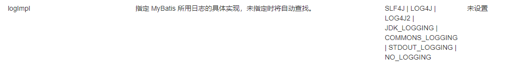

SLF4J | LOG4J | **LOG4J2**【掌握】 | JDK_LOGGING | COMMONS_LOGGING | **STDOUT_LOGGING**【掌握】 | NO_LOGGING

### 日志工厂

```xml
<!-- 标准的日志工厂实现 -->
<settings>
    <setting name="logImpl" value="STDOUT_LOGGING"/>
</settings>
```

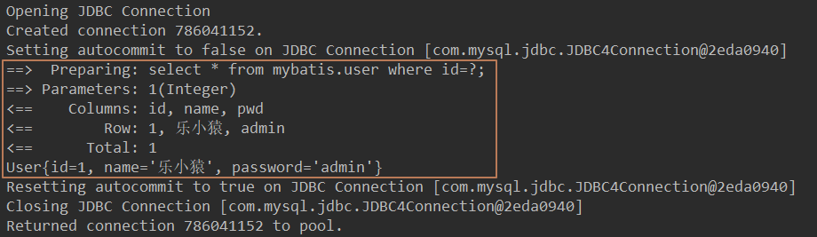

### LOG4J

> 通过使用Log4j，我们可以控制日志信息输送的目的地是控制台、文件、GUI组件，甚至是套接口服务器、NT的事件记录器、UNIX Syslog守护进程等；我们也可以控制每一条日志的输出格式；通过定义每一条日志信息的级别，我们能够更加细致地控制日志的生成过程。可以通过一个配置文件来灵活地进行配置，而不需要修改应用的代码。

- 先导入log4j的包

```xml
<!-- https://mvnrepository.com/artifact/log4j/log4j -->
<dependency>
    <groupId>log4j</groupId>
    <artifactId>log4j</artifactId>
    <version>1.2.17</version>
</dependency>
```

- 建立log4j.properties

```properties
### set log levels ###
log4j.rootLogger = DEBUG , C , D , E

### console ###
log4j.appender.C = org.apache.log4j.ConsoleAppender
log4j.appender.C.Target = System.out
log4j.appender.C.layout = org.apache.log4j.PatternLayout
log4j.appender.C.layout.ConversionPattern = [mybatis_study][%p] [%-d{yyyy-MM-dd HH\:mm\:ss}] %C.%M(%L) | %m%n

### log file ###
log4j.appender.D = org.apache.log4j.DailyRollingFileAppender
log4j.appender.D.File = ./logs/mybatis_study.log
log4j.appender.D.Append = true
log4j.appender.D.Threshold = INFO
log4j.appender.D.layout = org.apache.log4j.PatternLayout
log4j.appender.D.layout.ConversionPattern = [mybatis_study][%p] [%-d{yyyy-MM-dd HH\:mm\:ss}] %C.%M(%L) | %m%n

### exception ###
log4j.appender.E = org.apache.log4j.DailyRollingFileAppender
log4j.appender.E.File = ../logs/mybatis_study_error.log
log4j.appender.E.Append = true
log4j.appender.E.Threshold = ERROR
log4j.appender.E.layout = org.apache.log4j.PatternLayout
log4j.appender.E.layout.ConversionPattern = [mybatis_study][%p] [%-d{yyyy-MM-dd HH\:mm\:ss}] %C.%M(%L) | %m%n

###mybatis show sql###
log4j.logger.com.ibatis=debug
log4j.logger.com.ibatis.common.jdbc.SimpleDataSource=debug
log4j.logger.com.ibatis.common.jdbc.ScriptRunner=debug
log4j.logger.com.ibatis.sqlmap.engine.impl.SqlMapClientDelegate=debug

log4j.logger.java.sql.Connection=debug
log4j.logger.java.sql.Statement=debug
log4j.logger.java.sql.PreparedStatement=debug
```

- 核心配置文件中设置支持

```xml
<settings>
     <setting name="logImpl" value="LOG4J"/>
</settings>
```

- 测试类中

```java
//注意导的是这个包
import org.apache.log4j.Logger;

//定义属性
static Logger logger = Logger.getLogger(UserDaoTest.class);

//测试
 @Test
public void getUserLogTest(){
    logger.info("[info]测试方法getUserLogTest成功");
    logger.debug("[debug]测试方法getUserLogTest成功");
    logger.error("[error]测试方法getUserLogTest成功");
}
```

> 常用的方法：`logger.info()`、`logger.debug()`、`logger.error()`

## 分页

### 使用limit分页

```sql
select * from user limit startIndex,pageSize; #startIndex:起始下标，pageSize：每页显示的条数
```

如：

```sql
select * from user limit 1,3;
```

### 使用MyBatis实现分页

> 三步曲：写接口-->写Mapper.xml-->写测试

1. 写接口

```java
 //limit分页
List<User> getUserByLimit(Map<String, Integer> map);
```

2. 写Mapper.xml

```xml
<select id="getUserByLimit" resultMap="UserMap" parameterType="map">
    select * from mybatis.user limit #{startIndex},#{pageSize};
</select>
```

3. 写测试

```java
 @Test
public void getUserByLimitTest(){
    SqlSession sqlSession = MyBatisUtil.getSqlSession();
    UserMapper mapper = sqlSession.getMapper(UserMapper.class);

    HashMap<String, Integer> map = new HashMap<String, Integer>();
    map.put("startIndex", 1);
    map.put("pageSize", 3);
    List<User> userByLimit = mapper.getUserByLimit(map);
    for (User user : userByLimit) {
        System.out.println(user);
    }

    sqlSession.close();
}
```

运行结果：

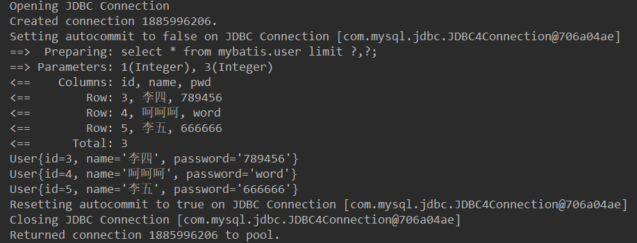

## 使用注解开发

- 在工具类中开启自动提交事务

```java
public static SqlSession getSqlSession() {
    return sqlSessionFactory.openSession(true); //参数为true，表示开启自动提交事务
}
```


1. 写接口，在接口上实现注解

```java
 @Select("select * from user")
List <User> getUserAll();

//注：SQL语句中取的参数为@Param()注解中指定的参数名
@Select("select * from user where id=#{uid}")
User getUserById(@Param("uid") int id );

//注：引用类型的参数不使用@Param()注解，SQL中通过#{}取出的参数为实体类中的属性
@Insert("insert into user(id, name, pwd) values(#{id},#{name},#{password})")
int insertUser(User user);

@Delete("delete from user where id=#{id}")
int deleteUser(@Param("id") int id);
```

2. 在核心配置文件中绑定接口

> 不需要使用Mapper.xml，所以需要重新绑定接口，使用class属性

```xml
<mappers>
    <!--需要绑定接口-->
    <mapper class="com.mybatis.dao.UserMapper"/>
</mappers>
```

3. 测试

```java
@Test
public void getUserAllTest(){
    SqlSession sqlSession = MyBatisUtil.getSqlSession();
    UserMapper mapper = sqlSession.getMapper(UserMapper.class);

    List<User> userAll = mapper.getUserAll();
    for (User user : userAll) {
        System.out.println(user);
    }

    sqlSession.close();

}

@Test
public void getUserByIdTest(){
    SqlSession sqlSession = MyBatisUtil.getSqlSession();
    UserMapper mapper = sqlSession.getMapper(UserMapper.class);

    User userById = mapper.getUserById(3);
    System.out.println(userById);

    sqlSession.close();
}

@Test
public void insertUserTest(){
    SqlSession sqlSession = MyBatisUtil.getSqlSession();
    UserMapper mapper = sqlSession.getMapper(UserMapper.class);

    mapper.insertUser(new User(6, "HelloInsert", "insertHello"));

    sqlSession.close();
}

@Test
public void deleteUserTest(){
    SqlSession sqlSession = MyBatisUtil.getSqlSession();
    UserMapper mapper = sqlSession.getMapper(UserMapper.class);

    mapper.deleteUser(4);

    sqlSession.close();
}
```

4. 运行结果：

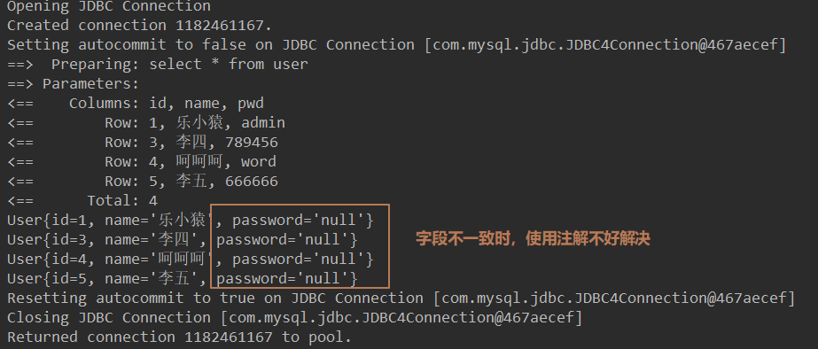

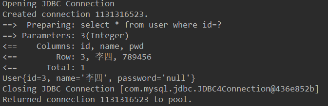

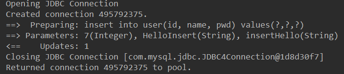

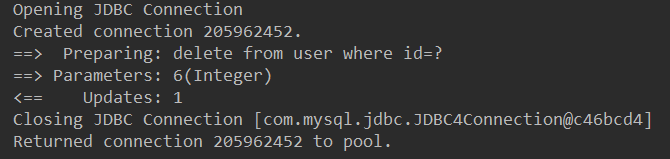

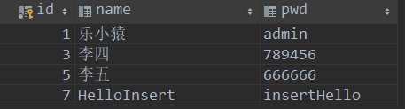

> 注意：使用注解来映射简单语句会使代码显得更加简洁，然而对于稍微复杂一点的语句，Java 注解就力不从心了，并且会显得更加混乱。

**关于@Param()注解**

- 基本类型的参数和String类型，需要加上
- 引用类型不需要加
- SQL语句中取的参数为@Param()注解中指定的参数名

## LomBok

- 访问：[https://projectlombok.org/](https://projectlombok.org/)

> 偷懒神器。。。

使用：

1. 在IDEA中安装LomBok插件

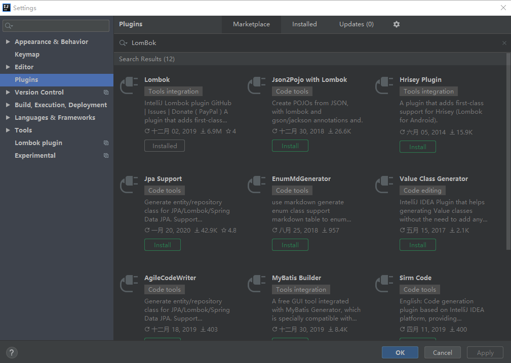

2. 导入Maven依赖

```xml
<dependencies>
    <dependency>
        <groupId>org.projectlombok</groupId>
        <artifactId>lombok</artifactId>
        <version>1.18.10</version>
    </dependency>
</dependencies>
```

3. 实体类上加注解

```java
@Getter
@Setter
@AllArgsConstructor
@NoArgsConstructor
public class User {
    private int id;
    private String name;
    private String password;
}
```

4. 常用注解

> @Setter ：注解在类或字段，注解在类时为所有字段生成setter方法，注解在字段上时只为该字段生成setter方法。
>
> @Getter ：使用方法同上，区别在于生成的是getter方法。
>
> @ToString ：注解在类，添加toString方法。
>
> @EqualsAndHashCode： 注解在类，生成hashCode和equals方法。
>
> @NoArgsConstructor： 注解在类，生成无参的构造方法。
>
> @RequiredArgsConstructor： 注解在类，为类中需要特殊处理的字段生成构造方法，比如final和被@NonNull注解的字段。
>
> @AllArgsConstructor： 注解在类，生成包含类中所有字段的构造方法。
>
> @Data： 注解在类，生成setter/getter、equals、canEqual、hashCode、toString方法，如为final属性，则不会为该属性生成setter方法。
>
> @Slf4j： 注解在类，生成log变量，严格意义来说是常量。

## 复杂查询环境

> 工具类和核心配置文件与之前的基本相同，核心配置文件中要重新绑定接口

### 1. 新建表

```sql
create table teacher (
    id int(10) not null primary key,
    name varchar(30) default null
) engine = innodb default charset = utf8mb4;

insert into teacher (id , name) values (1, '徐老师');

create table student (
    id int(10) not null primary key ,
    name varchar(30) default null,
    tid int(10) default null,
    key fkid (tid),
    constraint fkid foreign key (tid) references teacher (id)
)engine = innodb default charset = utf8mb4;

insert into student (id, name, tid) values ('1', '小明', '1');
insert into student (id, name, tid) values ('2', '小红', '1');
insert into student (id, name, tid) values ('3', '小张', '1');
insert into student (id, name, tid) values ('4', '小李', '1');
insert into student (id, name, tid) values ('5', '小王', '1');
```

### 2. 导入LomBok

```xml
<dependencies>
    <dependency>
        <groupId>org.projectlombok</groupId>
        <artifactId>lombok</artifactId>
        <version>1.18.10</version>
    </dependency>
</dependencies>
```

### 3. 新建实体类

```java
@Getter
@Setter
@ToString
@AllArgsConstructor
@NoArgsConstructor
public class Student {
    private int id;
    private String name;

    //一个学生关联一个老师
    private Teacher teacher;
}
```

```java
@Getter
@Setter
@ToString
@AllArgsConstructor
@NoArgsConstructor
public class Teacher {
    private int id;
    private String name;
}
```

### 4.建立Mapper接口

```java
public interface StudentMapper {
}
```

```java
public interface TeacherMapper {

    @Select("select * from teacher")
    Teacher getTeacher();
}
```

### 5. 建立Mapper.xml

> 在resources目录下新建com/mybatis/dao/StudentMapper.xml和com/mybatis/dao/TeacherMapper.xml文件。（Mapper.xml的目录尽量保持和所绑定的接口目录一致）

```xml
<?xml version="1.0" encoding="UTF-8" ?>
<!DOCTYPE mapper
        PUBLIC "-//mybatis.org//DTD Mapper 3.0//EN"
        "http://mybatis.org/dtd/mybatis-3-mapper.dtd">

<mapper namespace="com.mybatis.dao.StudentMapper">

</mapper>
```

```xml
<?xml version="1.0" encoding="UTF-8" ?>
<!DOCTYPE mapper
        PUBLIC "-//mybatis.org//DTD Mapper 3.0//EN"
        "http://mybatis.org/dtd/mybatis-3-mapper.dtd">

<mapper namespace="com.mybatis.dao.TeacherMapper">

</mapper>
```

### 6.在核心配置文件中绑定Mapper接口

```xml
<mappers>
    <mapper resource="com/mybatis/dao/StudentMapper.xml"/>
    <mapper resource="com/mybatis/dao/TeacherMapper.xml"/>
</mappers>
```

### 7. 测试

```java
@Test
public void getTeacher(){
    SqlSession sqlSession = MyBatisUtil.getSqlSession();
    TeacherMapper mapper = sqlSession.getMapper(TeacherMapper.class);
    Teacher teacher = mapper.getTeacher();
    System.out.println(teacher);
    sqlSession.close();
}
```

运行结果：

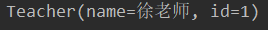

## 连表查询（多对一）

### 1. 环境搭建

>  和上面一样

### 2. 按查询嵌套处理

- 查询所有学生信息
- 根据查询出来的学生的tid，寻找对应的老师

```xml
<resultMap id="StudentTeacher" type="student">
    <!--映射参数不一致的情况-->
    <!-- 复杂的属性：对象类型：association   集合类型：collection -->
    <association property="teacher" column="tid" javaType="Teacher" select="getTeacherInfo"/>
</resultMap>

<select id="getStudentInfo" resultMap="StudentTeacher">
    select * from student
</select>

<select id="getTeacherInfo" resultType="teacher">
    select * from teacher where id=#{id}
</select>
```

```java
//查询所有学生和老师信息
List <Student> getStudentInfo();
```

```java
@Test
public void getStudentInfoTest(){
    SqlSession sqlSession = MyBatisUtil.getSqlSession();
    StudentMapper mapper = sqlSession.getMapper(StudentMapper.class);
    List<Student> studentInfo = mapper.getStudentInfo();
    for (Student student : studentInfo) {
        System.out.println(student);
    }
}
```


### 3. 按结果嵌套查询

```xml
<!--方式二:按照结果嵌套查询【推荐】-->
<resultMap id="StudentTeacher2" type="student">
    <!-- 学生映射学生的，复杂类型（对象类型）用association，再在里面映射老师的信息 -->
    <result property="id" column="sid"/>
    <result property="name" column="sname"/>
    <association property="teacher" javaType="Teacher">
         <result property="id" column="tid"/>
         <result property="name" column="tname"/>
    </association>
</resultMap>

<select id="getStudentInfo2" resultMap="StudentTeacher2">
    select s.id sid, s.name sname,t.id tid, t.name tname
    from student s,teacher t
    where s.tid = t.id;
</select>
```

```java
List <Student> getStudentInfo2();
```

```java
@Test
public void getStudentInfoTest2(){
    SqlSession sqlSession = MyBatisUtil.getSqlSession();
    StudentMapper mapper = sqlSession.getMapper(StudentMapper.class);
    List<Student> studentInfo = mapper.getStudentInfo2();
    for (Student student : studentInfo) {
        System.out.println(student);
    }
}
```

## 连表查询 (一对多)

### 1. 环境搭建

```java
@Getter
@Setter
@ToString
@AllArgsConstructor
@NoArgsConstructor
public class Student {
    private int id;
    private String name;
    private int tid;
}
```

```java
@Getter
@Setter
@ToString
@AllArgsConstructor
@NoArgsConstructor
public class Teacher {
    private int id;
    private String name;

    //一个老师拥有多个学生
    private List<Student> students;
}
```

```java
public interface TeacherMapper {
    //获得指定老师及其所有学生信息
    Teacher getTeacherAndStudent(@Param("tid") int id);
}`
```

### 2. 按结果嵌套查询

```xml
<select id="getTeacherAndStudent" resultMap="TeacherStudent">
    select t.id tid, t.name tname, s.id sid, s.name sname
    from teacher t, student s
    where t.id = s.tid and t.id=#{tid};
</select>

<resultMap id="TeacherStudent" type="teacher">
    <!-- 先映射老师的信息，复杂类型(集合类型)用collection，再在里面映射学生的信息-->
    <result property="id" column="tid"/>
    <result property="name" column="tname"/>
    <!-- 复杂属性：集合用collection，javaType：指定属性的类型，ofType：集合中的泛型信息 -->
    <collection property="students" ofType="student">
        <result property="id" column="sid"/>
        <result property="name" column="sname"/>
        <result property="tid" column="tid"/>
    </collection>
</resultMap>
```

测试：

```java
@Test
public void getTeacherAndStudentTest(){
    SqlSession sqlSession = MyBatisUtil.getSqlSession();
    TeacherMapper mapper = sqlSession.getMapper(TeacherMapper.class);
    Teacher teacherAndStudent = mapper.getTeacherAndStudent(2);
    System.out.println(teacherAndStudent);
    sqlSession.close();
}
```

查询结果：

`Teacher(id=2, name=乐小猿, students=[Student(id=4, name=小李, tid=2), Student(id=5, name=小王, tid=2)])`

### 3. 按查询嵌套查询

```xml
<!--  按查询嵌套查询  -->
<select id="getTeacherAndStudent2" resultMap="TeacherStudent2">
    select * from teacher where id=#{tid};
</select>

<resultMap id="TeacherStudent2" type="teacher">
    <collection property="students" column="id" javaType="ArrayList" ofType="student" select="getStudentByTeacher"/>
</resultMap>

<select id="getStudentByTeacher" resultType="student">
    select * from student where tid=#{id}
</select>
```

测试：

```java
@Test
public void getTeacherAndStudent2Test(){
    SqlSession sqlSession = MyBatisUtil.getSqlSession();
    TeacherMapper mapper = sqlSession.getMapper(TeacherMapper.class);
    Teacher teacherAndStudent = mapper.getTeacherAndStudent2(1);
    System.out.println(teacherAndStudent);
    sqlSession.close();
}
```

查询结果：

`Teacher(id=0, name=徐老师, students=[Student(id=1, name=小明, tid=1), Student(id=2, name=小红, tid=1), Student(id=3, name=小张, tid=1)])`

> 这里查出来的老师id为0，不好处理，推荐第一种

### 小结

1. 关联-association【多对一】
2. 集合-collection【一对多】
3. javaType  &   ofType
   - javaType：用来指定实体类中属性的类型
   - ofType：用来指定映射到List或集合中的pojo类型，泛型中的约束类型

## 动态SQL

> - **在SQL层面执行一个逻辑代码**
> - **根据不同的条件生成不同的SQL语句**
> - **主要还是在拼接SQL，只要保证SQL的正确性，去排列组合就好了**

动态 SQL 元素和 JSTL 或基于类似 XML 的文本处理器相似。在 MyBatis 之前的版本中，有很多元素需要花时间了解。MyBatis 3 大大精简了元素种类，现在只需学习原来一半的元素便可。MyBatis 采用功能强大的基于 OGNL 的表达式来淘汰其它大部分元素。

- if
- choose (when, otherwise)
- trim (where, set)
- foreach

### 搭建环境

1. 新建表Blog

```sql
create table blog (
    id varchar(50) primary key not null comment '博客id',
    title varchar(100) not null comment '博客标题',
    author varchar(30) not null comment '博客作者',
    create_time datetime not null comment '创建时间',
    views int(30) not null comment '浏览量'
) engine = innodb default charset = utf8mb4;
```

2. 新建表对应的实体类

```java
import lombok.Data;

import java.util.Date;

@Data
public class Blog {
    private String id;
    private String title;
    private String author;
    private Date createTime;   //属性名和字段名不一致
    private int views;
}
```

> 属性名和字段名不一致
>
> 解决：在MyBatis核心配置文件中配置设置

```xml
<!-- 是否开启自动驼峰命名规则（camel case）映射，即从经典数据库列名 A_COLUMN 到经典 Java 属性名 aColumn 的类似映射。 -->
<settings>
    <setting name="mapUnderscoreToCamelCase" value="true"/>
</settings>
```

3. 编写实体类对应的Mapper接口和Mapper.xml

```java
public interface BlogMapper {
    //插入博客
    int addBlog(Blog blog);
}
```

```xml
<?xml version="1.0" encoding="UTF-8" ?>
<!DOCTYPE mapper
        PUBLIC "-//mybatis.org//DTD Mapper 3.0//EN"
        "http://mybatis.org/dtd/mybatis-3-mapper.dtd">

<mapper namespace="com.mybatis.dao.BlogMapper">
    <insert id="addBlog" parameterType="blog">
        insert into blog (id, title, author, create_time, views)
        values (#{id}, #{title}, #{author}, #{createTime}, #{views});
    </insert>
</mapper>
```

4. id随机生成，编写对应的工具类

```java
public class IdUtil {
    public static String getId(){
        return UUID.randomUUID().toString().replaceAll("-","");
    }

    @Test
    public void Test(){
        System.out.println(IdUtil.getId());
        System.out.println(IdUtil.getId());
        System.out.println(IdUtil.getId());
    }
}
```

5. 测试

```java
@Test
public void addBlogTest(){
    SqlSession sqlSession = MyBatisUtil.getSqlSession();
    BlogMapper mapper = sqlSession.getMapper(BlogMapper.class);

    Blog blog = new Blog();
    blog.setId(IdUtil.getId());
    blog.setTitle("MyBatis如此简单");
    blog.setAuthor("乐小猿");
    blog.setCreateTime(new Date());
    blog.setViews(20200202);

    mapper.addBlog(blog);

    blog.setId(IdUtil.getId());
    blog.setTitle("Spring如此简单");
    blog.setAuthor("快乐的小小程序猿");
    blog.setCreateTime(new Date());
    blog.setViews(20202020);

    mapper.addBlog(blog);

    blog.setId(IdUtil.getId());
    blog.setTitle("SpringMVC如此简单");
    blog.setAuthor("乐小猿");
    blog.setCreateTime(new Date());
    blog.setViews(20202002);

    mapper.addBlog(blog);

    blog.setId(IdUtil.getId());
    blog.setTitle("Spring Boot如此简单");
    blog.setAuthor("快乐的小小程序猿");
    blog.setCreateTime(new Date());
    blog.setViews(20202222);

    mapper.addBlog(blog);

    sqlSession.close();
}
```

### if

1. 写接口

```java
//查询博客
List<Blog> queryBlogIf(Map map);
```

2. 写SQL

```xml
<select id="queryBlogIf" parameterType="map" resultType="blog">
    select * from blog where 1=1
    <if test="title != null">
        and title=#{title}
    </if>
    <if test="author != null">
        and author=#{author}
    </if>
    ;
</select>
```

3. 测试

```java
@Test
public void queryBlogIfTest(){
    SqlSession sqlSession = MyBatisUtil.getSqlSession();
    BlogMapper mapper = sqlSession.getMapper(BlogMapper.class);

    HashMap<String, String> map = new HashMap<String, String>();
    map.put("title","Spring Boot如此简单");
    //map.put("author" , "快乐的小小程序猿");
    map.put("author" , "乐小猿");

    List<Blog> blogList = mapper.queryBlogIf(map);
    for (Blog blog : blogList) {
        System.out.println(blog);
    }

    sqlSession.close();
}
```

### choose, when, otherwise

> 提供了“title”就按“title”查找，提供了“author”就按“author”查找的情形，若两者都没有提供，就返回所有符合条件的 blog

1. 写接口

```java
//查询博客--使用choose
List<Blog> queryBlogChoose(Map map);
```

2. 写SQL

```xml
<select id="queryBlogChoose" resultType="blog" parameterType="map">
    select * from blog where 1=1
    <choose>
        <when test="title != null">
            and title like #{title}
        </when>
        <when test="author != null">
            and author like #{author}
        </when>
        <otherwise>
            and views > 20202020
        </otherwise>
    </choose>
</select>
```

3. 写测试

```java
@Test
public void queryBlogChooseTest(){
    SqlSession sqlSession = MyBatisUtil.getSqlSession();
    BlogMapper mapper = sqlSession.getMapper(BlogMapper.class);

    HashMap<String, String> map = new HashMap<String, String>();
    //map.put("title","%Spring%");
    map.put("author" , "%快乐%");

    List<Blog> blogList = mapper.queryBlogChoose(map);

    for (Blog blog : blogList) {
        System.out.println(blog);
    }

    sqlSession.close();
}
```

### trim, where, set

- **where**

> *where* 元素只会在至少有一个子元素的条件返回 SQL 子句的情况下才去插入“WHERE”子句。而且，若语句的开头为“AND”或“OR”，*where* 元素也会将它们去除。
>
> 可以防止出现
>
> ```sql
> SELECT * FROM BLOG
> WHERE
> #或
> SELECT * FROM BLOG
> WHERE
> AND title like ‘someTitle’
> ```
>
> 

1. 写接口

```java
//查询博客--使用where
List<Blog> queryBlogWhere(Map map);
```

2. 写SQL

```xml
<select id="queryBlogWhere" resultType="blog" parameterType="map">
    select * from blog
    <where>
        <if test="title != null">
            title=#{title}
        </if>
        <if test="author != null">
            and author=#{author}
        </if>
    </where>
</select>
```

3. 写测试

```java
@Test
public void queryBlogWhereTest(){
    SqlSession sqlSession = MyBatisUtil.getSqlSession();
    BlogMapper mapper = sqlSession.getMapper(BlogMapper.class);

    HashMap<String, String> map = new HashMap<String, String>();
    //map.put("title","Spring Boot如此简单");
    map.put("author" , "乐小猿");

    List<Blog> blogList = mapper.queryBlogWhere(map);
    for (Blog blog : blogList) {
        System.out.println(blog);
    }

    sqlSession.close();
}
```

- **set**

> 用于动态更新语句的解决方案叫做 *set*。*set* 元素可以用于动态包含需要更新的列，而舍去其它的。这里，*set* 元素会动态前置 SET 关键字，同时也会删掉无关的逗号，因为用了条件语句之后很可能就会在生成的 SQL 语句的后面留下这些逗号。（译者注：因为用的是“if”元素，若最后一个“if”没有匹配上而前面的匹配上，SQL 语句的最后就会有一个逗号遗留）

1. 写接口

```java
//更新博客
int updateBlogSet(Map map);
```

2. 写SQL

```xml
<update id="updateBlogSet" parameterType="map">
    update blog
    <set>
        <if test="views != 20200202">views = #{views},</if>
        <if test="author != null">author=#{author}</if>
    </set>
    where id=#{id}
</update>
```

3. 写测试

```java
@Test
public void updateBlogSetTest(){
    SqlSession sqlSession = MyBatisUtil.getSqlSession();
    BlogMapper mapper = sqlSession.getMapper(BlogMapper.class);

    HashMap<String, String> map = new HashMap<String, String>();
    map.put("id" , "54f147aa553d4440b565f098495b3e3b");
    map.put("views" , "99999");
    map.put("author" , "徐仕成");
    mapper.updateBlogSet(map);

    sqlSession.close();

}
```

### foreach

> 通常是在构建 IN 条件语句的时候使用，*foreach* 元素的功能非常强大，它允许你指定一个集合，声明可以在元素体内使用的集合项（item）和索引（index）变量。它也允许你指定开头与结尾的字符串以及在迭代结果之间放置分隔符。
>
> **注意**：你可以将任何可迭代对象（如 List、Set 等）、Map 对象或者数组对象传递给 *foreach* 作为集合参数。当使用可迭代对象或者数组时，index 是当前迭代的次数，item 的值是本次迭代获取的元素。当使用 Map 对象（或者 Map.Entry 对象的集合）时，index 是键，item 是值。

1. 写接口

```java
//查询博客--使用foreach
List<Blog> queryBlogForeach(Map map);
```

2. 写SQL

```xml
<!-- select * from blog where author is not null and author in ('徐仕成', '快乐的小小程序猿');   -->
<select id="queryBlogForeach" parameterType="map" resultType="blog">
    select * from blog
    <where>
        author is not null and
        author in
        <foreach collection="authorList" item="item" index="index" open="(" separator="," close=")">
            #{item}
        </foreach>

    </where>
</select>
```

3. 测试

```java
@Test
public void queryBlogForeachTest(){
    SqlSession sqlSession = MyBatisUtil.getSqlSession();
    BlogMapper mapper = sqlSession.getMapper(BlogMapper.class);

    ArrayList<String> list = new ArrayList<String>();
    HashMap<String, Object> map = new HashMap<String, Object>();

    list.add("徐仕成");
    list.add("快乐的小小程序猿");

    map.put("authorList", list);

    List<Blog> blogList = mapper.queryBlogForeach(map);
    for (Blog blog : blogList) {
        System.out.println(blog);
    }

    sqlSession.close();

}
```


### SQL片段

1. 使用`<sql><sql/>`标签抽取公共部分

```xml
<sql id="if-title-author">
    <if test="title != null">
        and title=#{title}
    </if>
    <if test="author != null">
        and author=#{author}
    </if>
</sql>
```

2. 使用`<include refid=""/>`标签引用片段

```xml
 <select id="queryBlogIf" parameterType="map" resultType="blog">
        select * from blog where 1=1
        <include refid="if-title-author"/>
    </select>
```

注意事项：

- 最好基于一个表来定义SQL片段
- 不要存在`where`标签

## 缓存

> MyBatis 内置了一个强大的事务性查询缓存机制，它可以非常方便地配置和定制。 为了使它更加强大而且易于配置，我们对 MyBatis 3 中的缓存实现进行了许多改进。
>
> 默认情况下，只启用了本地的会话缓存(`getSqlSession()`到`sqlSession.close()`)，它仅仅对一个会话中的数据进行缓存。 

- 默认情况下，一级缓存开启。（SqlSession级别的缓存，也称为本地缓存）
- 二级缓存需要手动开启，是基于Mapper.xml中的namespace级别的缓存

### 一级缓存

- 与数据库同一次会话期间查询到的数据会放在本地缓存中
- 以后如果需要获取相同的数据，直接从缓存中拿，不会重新执行查询语句

测试：

1. 搭环境（开启日志）

```java
@Data
@AllArgsConstructor
@NoArgsConstructor
public class User {
    private int id;
    private String name;
    private String pwd;
}
```

```java
public interface UserMapper {

    User queryUserById(@Param("id") int id);
    
    int updateUser(User user);

}
```

```xml
<!-- UserMapper.xml -->
<select id="queryUserById" resultType="user">
    select * from user where id=#{id}
</select>

<update id="updateUser" parameterType="user">
     update user set name=#{name},pwd=#{pwd} where id=#{id}
</update>
```

```xml
<!-- mybatis-config.xml -->
<mappers>
    <mapper resource="com/mybatis/dao/UserMapper.xml"/>
</mappers>
```

2. 测试

- 测试1：在一个会话中，连续查询同一个用户

```java
@Test
public void getUserByIdTest() {
    SqlSession sqlSession = MyBatisUtil.getSqlSession();
    UserMapper mapper = sqlSession.getMapper(UserMapper.class);

    User user = mapper.queryUserById(1);
    System.out.println(user);

    System.out.println("===============");

    User user2 = mapper.queryUserById(1);
    System.out.println(user2);
   
    sqlSession.close();

}
```

结果：第二次查询没有重新执行select语句，而是通过缓存读取

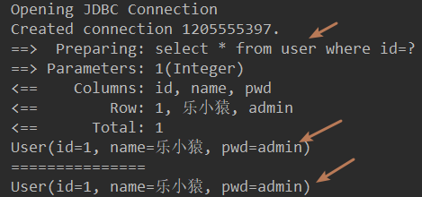

- 测试2：在一个会话中，查询不同的用户

```java
@Test
public void getUserByIdTest() {
    SqlSession sqlSession = MyBatisUtil.getSqlSession();
    UserMapper mapper = sqlSession.getMapper(UserMapper.class);

    User user = mapper.queryUserById(1);
    System.out.println(user);

    System.out.println("===============");

    User user2 = mapper.queryUserById(3);
    System.out.println(user2);

    sqlSession.close();

}
```

结果：查询不同的用户，会重新执行select语句

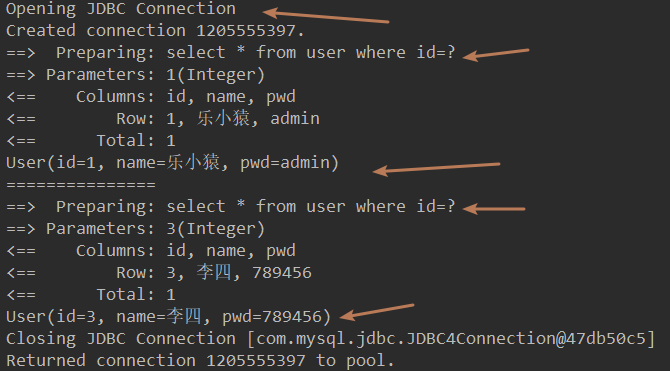

- 测试3：更新另一个用户，查询同一个用户

```java
@Test
    public void getUserByIdTest() {
        SqlSession sqlSession = MyBatisUtil.getSqlSession();
        UserMapper mapper = sqlSession.getMapper(UserMapper.class);

        User user = mapper.queryUserById(1);
        System.out.println(user);

        mapper.updateUser(new User(3, "update","updateUser"));

        System.out.println("===============");

        User user2 = mapper.queryUserById(1);
        System.out.println(user2);

        System.out.println(user==user2);

        sqlSession.close();

    }
```

结果：更新另一个用户，查询同一个用户，仍然会重新执行select语句。**所有的增删改都会刷新缓存**。

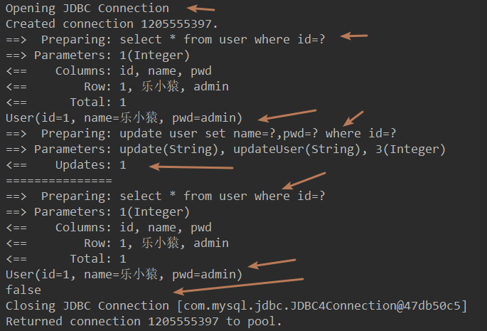

- 测试4：查询同一个用户，手动清理缓存

```java
 @Test
    public void getUserByIdTest() {
        SqlSession sqlSession = MyBatisUtil.getSqlSession();
        UserMapper mapper = sqlSession.getMapper(UserMapper.class);

        User user = mapper.queryUserById(1);
        System.out.println(user);

        //mapper.updateUser(new User(3, "update","updateUser"));
        sqlSession.clearCache();  //手动清理缓存

        System.out.println("===============");

        User user2 = mapper.queryUserById(1);
        System.out.println(user2);

        System.out.println(user==user2);

        sqlSession.close();

    }
```

结果：会重新执行select语句

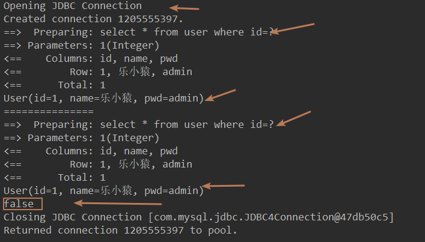

### 二级缓存

- 也称全局缓存
- 基于namespace级别的缓存，一个命名空间对应一个二级缓存
- 一级缓存中的数据会保存到为二级缓存中，当一个会话关闭时，一级缓存中的数据没了，可以从二级缓存中获取
- 不同mapper查出的数据会放在自己对应的缓存（相当于一个map）中

测试：

1. 开启全局缓存(核心配置文件中设置)

```xml
<!-- 显示的开启全局缓存-->
<setting name="cacheEnabled" value="true"/>
```

2. 在要使用的Mapper.xml中开启

- 简单开启：

```xml
<!-- 在当前Mapper.xml中开启二级缓存 -->
<cache />
```

- 自定义：

```xml
<!-- 在当前Mapper.xml中开启二级缓存 -->
<!--
    创建了一个 FIFO 缓存，每隔 60 秒刷新，最多可以存储结果对象或列表的 512 个引用，
    而且返回的对象被认为是只读的
    -->
<cache
       eviction="FIFO"
       flushInterval="60000"
       size="512"
       readOnly="true"/>
```

3. 测试

- 测试1：开启两个会话，查询同一个用户

```java
@Test
public void getUserByIdTest2() {
    SqlSession sqlSession = MyBatisUtil.getSqlSession();
    UserMapper mapper = sqlSession.getMapper(UserMapper.class);

    SqlSession sqlSession2 = MyBatisUtil.getSqlSession();
    UserMapper mapper2 = sqlSession2.getMapper(UserMapper.class);

    User user = mapper.queryUserById(1);
    System.out.println(user);

    System.out.println("===============");

    User user2 = mapper2.queryUserById(1);
    System.out.println(user2);

    System.out.println(user==user2);

    sqlSession.close();
    sqlSession2.close();
}
```

结果：第二次查询会重新连接数据库和重新执行select语句


- 测试2：第一个会话关闭后，在第二个会话中查询同一个用户

```java
@Test
public void getUserByIdTest2() {
    SqlSession sqlSession = MyBatisUtil.getSqlSession();
    UserMapper mapper = sqlSession.getMapper(UserMapper.class);

    SqlSession sqlSession2 = MyBatisUtil.getSqlSession();
    UserMapper mapper2 = sqlSession2.getMapper(UserMapper.class);

    User user = mapper.queryUserById(1);
    System.out.println(user);

    sqlSession.close();

    System.out.println("===============");

    User user2 = mapper2.queryUserById(1);
    System.out.println(user2);

    System.out.println(user==user2);

    sqlSession2.close();
}
```

结果：第二次查询从缓存中获取，没有重新连接数据库和执行select语句。

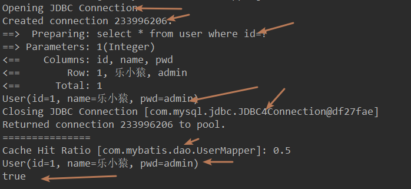

遇到的问题：

- 使用简单的缓存`<cache />`，需要将实体类序列化,否则会报错：

>  Caused by: java.io.NotSerializableException: com.mybatis.pojo.User

将实体类序列化：

```java
@Data
@AllArgsConstructor
@NoArgsConstructor
public class User implements Serializable {
    private int id;
    private String name;
    private String pwd;
}
```

小结：

- 在同一个Mapper下才有效
- 所有的数据会先放到一级缓存下
- 只有当会话提交或关闭时，才会提交到二级缓存中

### 缓存原理

1. 缓存顺序：

- 一次查询，先走二级缓存，如果二级缓存中没有，再看一级缓存中有没有，如果一级缓存中没有就连接数据库查询。

### 自定义缓存-EhCache 

> Ehcache是一种广泛使用的开源Java分布式缓存。主要面向通用缓存,Java EE和轻量级容器。


